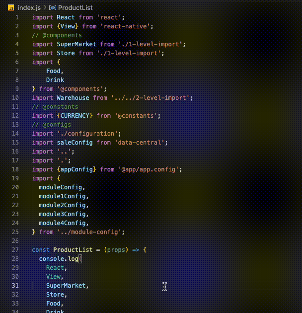
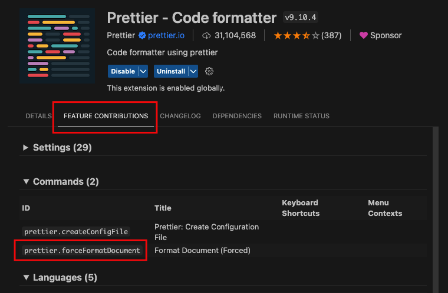
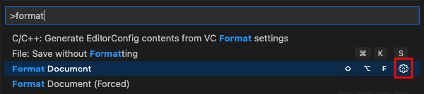
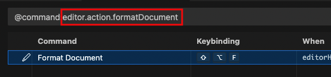

# ES6 Import Sorter

Your imports will be sorted neatly, and organized by sections (with customizable configs).

> - Support ES6 `import` syntax only.
> - This extension only sorts the imports and doesn't do the formatting, so you should format your file before using the tool (ex: using [`Prettier`][prettier]).


## Demo


<br/>


Before sorting:

```js
import React from 'react';
import {View} from 'react-native';
// @components
import SuperMarket from './1-level-import';
import Store from './1-level-import';
import {
    Food,
    Drink
} from '@components';
import Warehouse from '../../2-level-import';
// @constants
import {CURRENCY} from '@constants';
// @configs
import './configuration';
import saleConfig from 'data-central';
import '..';
import '.';
import {appConfig} from '@app/app.config';
import {
  moduleConfig,
  module1Config,
  module2Config,
  module3Config,
  module4Config,
} from '../module-config';

const ProductList = (props) => {
...
```

After sorting (use [`Prettier`][prettier] first):

```js
import React from 'react';
import {View} from 'react-native';
// @configs
import {appConfig} from '@app/app.config';
import saleConfig from 'data-central';
import '.';
import './configuration';
import '..';
import {
  moduleConfig,
  module1Config,
  module2Config,
  module3Config,
  module4Config,
} from '../module-config';
// @constants
import {CURRENCY} from '@constants';
// @components
import {Food, Drink} from '@components';
import Store from './1-level-import';
import SuperMarket from './1-level-import';
import Warehouse from '../../2-level-import';

const ProductList = (props) => {
...
```

## Table of Contents

1. [Usage](#usage)
2. [Story](#story)
3. [Anatomy](#anatomy)
4. [Configs](#configs)
   - [Sample code for demonstration](#sample-code-for-demonstration)
   - [Props](#props)

## Usage

> Highly recommend you should format your code first (manually or automatically by configuring [`preCommands`](#precommands) prop)

Using Command Palette

```
Press Cmd/Ctrl + Shift + P (MacOS/Window) 
-> ES6 Import Sorter: Sort
```

Using Keyboard shortcut

```
Press Cmd/Ctrl + alt + S (MacOS/Window)
```

## Story

I want the imports to be organized and followed some rules. For example, it needs to be sorted by section priority as predefined, by source path group priority, and by string length in each section.<br/><br/>
But sometimes, I or my team members forget the priority, or it takes time to sort the imports by source path group, string length, etc. then which leads to a mess.<br/><br/>
So, I created this extension to clear the problems.<br/>

## Anatomy

The main idea of this extension is to divide the whole imports into sections, sort statements inside each section, then rearrange each section by defined configs.

You can mark a sortable area by using `startImportSign` and `endImportSign`.

- **Start point** (match with `startImportSign`)
  - **Section title** (`sectionPrefix` + `sectionName`)<br/>
    ex: `// @configs`.<br/>
    If you consider `// @` as a `sectionPrefix` then `configs` is a `sectionName`<br/>
  - **Import statement**<br/>
    ex: `import smth, {component1, component2} from '@app'`<br/>
    You may want to consider `@` as a `sourcePathPrefix` to group everything like that together.<br/>
    -> That's means, you can group your imports before sorting by statement length.
- **End point** (match with `endImportSign`).

> The default behavior of sorting inside a section is by `max display import statement length` (not the raw text length).<br/>
> For example:
>
> ```js
> import {
>   // components inside an import statement will be sorted by length also.
>   View, 
>   SomeComponentWithLongName,  
> } from 'react-native';        
> // the length of `} from 'react-native';` is the max length of this import statement.
> ```

## Configs

If you want to use the configs, create a new file `.es6importsorterrc.json` in the root folder.

### Sample code for demonstration

The demonstration config's result will be applied to the below sample code:

```js
import React from 'react';                      // --> start non-titled section
import {View} from 'react-native';              // --> end non-titled section
// @components                                  // --> start titled section
import SuperMarket from './1-level-import';
import Store from './1-level-import';
import {
    Drink
    Food,
} from '@components';
import Warehouse from '../../2-level-import';   // --> end titled section
// @constants
import {CURRENCY} from '@constants';
// @configs
import './configuration';
import saleConfig from 'data-central';
import '..';
import '.';
import {appConfig} from '@app/app.config';
import {moduleConfig} from '../module-config';

const ProductList = React.FC<ProductListProps> props => {
...
```

<br/>

### Props

| Prop                                          | Type                               | Default          |
| --------------------------------------------- | ---------------------------------- | ---------------- |
| [`sectionPrefix`](#sectionprefix)             | string                             | -                |
| [`sectionNames`](#sectionnames)               | string[]                           | -                |
| [`sourcePathPrefixes`](#sourcepathprefixes)   | string[]                           | `['\\w', '\\.']` |
| [`startImportSign`](#startimportsign)         | string                             | -                |
| [`endImportSign`](#endimportsign)             | string                             | -                |
| [`statementTerminator`](#statementterminator) | string                             | `;`              |
| [`preCommands`](#precommands)                 | [`Command[]`](#command-properties) | -                |

---

<br/>

#### `sectionPrefix`

Define your prefix of sections. Every line of code, inside the sortable area, if starting with this prefix will be treated as a new section for dividing.

> NOTE: If you don't define this config then every line inside the sortable area will be sorted. If you do, only the titled section will be sorted and rearranged, every line inside non-titled sections will be ignored.

#### `sectionNames`

Define the list of names for the sections. The item's index is also the priority for section sorting.

All statements inside each section will be sorted by default behavior and then be rearranged to match priority with the index predefined. The sections that are not on the list will be put at the end of the sortable area.

<details>
    <summary>Usage</summary>
    <br/>

Config:

```js
{
    ...
    sectionNames: [
        "configs",      // 1st section
        "components",   // 2rd section
        ...
    ]
    ...
}
```

Result:

```js
import React from 'react';
import {View} from 'react-native';
// @configs
import '.';
import '..';
import './configuration';
import saleConfig from 'data-central';
import {appConfig} from '@app/app.config';
import {moduleConfig} from '../module-config';
// @components
import {
    Food,
    Drink
} from '@components';
import Store from './1-level-import';
import SuperMarket from './1-level-import';
import Warehouse from '../../2-level-import';
// @constants
import {CURRENCY} from '@constants';
...
```

</details>
<br/>

#### `sourcePathPrefixes`

- Default: `['\\w', '\\.']`

*Support `RegEx` pattern.*

Define the list of prefixes that you want to group for rearrangement inside a section.

Every import statement, that has a source path starting with one of the predefined prefixes, will be grouped together. Import statements inside each group will be sorted by default behavior. Then all groups will be rearrangement followed by the index defined before.

The item's index is also the priority for group sorting.

- Special case for `\\.` pattern:<br/>
    Every statement inside the group of the `.` source path has an extra default behavior. That is grouped one more time by imported folder level before being sorted by default.


<details>
    <summary>Usage</summary>
    <br/>

Config:

```js
{
    ...
    sourcePrefixes: [
        "@",     // 1st group - starts with '@'
        "\\w",      // 2nd group - starts with a word character
        "\\.",      // 3rd group - starts with a dot character
        ...
    ]
    ...
}
```

Result:

```js
import React from 'react';
import {View} from 'react-native';
// @components
import {
    Food,
    Drink
} from '@components';
import Store from './1-level-import';
import SuperMarket from './1-level-import';
import Warehouse from '../../2-level-import';
// @constants
import {CURRENCY} from '@constants';
// @configs
import {appConfig} from '@app/app.config';
import saleConfig from 'data-central';
import '.';
import './configuration';
import '..';
import {moduleConfig} from '../module-config';
...
```

</details>
<br/>

#### `startImportSign`

Define the start point of the sortable area.

If this prop is undefined or empty, the first line starts with `import` is the start point.

Otherwise, the sortable area will start from the next line, right after the line matches with this prop.

> This prop is compared strictly by '===' operator.

#### `endImportSign`

Define the end point of the sortable area.

If this prop is undefined or empty, the first empty line after the start point will be treated as the end point.

Otherwise, the sortable area will start from the next line.

> This prop is compared strictly by '===' operator.

#### `statementTerminator`

- Default: `;`

Define the terminator for an import statement.

#### `preCommands`

##### Command properties

```
| string
| {
    command: string,
    system?: 'vscode' | 'terminal'
  }
```

Define the list of commands that will be executed before sorting.

This is useful for the case that you want to do something else first (ex: format the file - please do that). It supports both terminal and VSCode command.

- You can get the command ID of the VSCode extension by following:
<br/>
<br/>

<br/>
<br/>

- You can get the command ID of the VSCode by following:
    - Press `Cmd/Ctrl+Shift+P` (MacOS/Window), then search for the command you want. Then press the ⚙️ icon on that command.
    <br/>
    <br/>
    
    <br/>
    <br/>
    - Copy the text after `@command:`
    <br/>
    <br/>
    
    <br/>
    <br/>

<details>
    <summary>Usage</summary>
    <br/>

Config:

```js
{
    ...
    preCommands: [
        // run some terminal command - silly demo
        "yarn", 
        // then, run some vscode command - highly recommend
        {
            command: "editor.action.formatDocument",    
            system: "vscode"
        },
        // then, run some terminal command - silly demo again
        { 
            command: "yarn cache clean", 
            system: "terminal"
        },
        ...
    ]
    ...
}
```

</details>
<br/>


<!-- References -->

[prettier]: https://marketplace.visualstudio.com/items?itemName=esbenp.prettier-vscode
